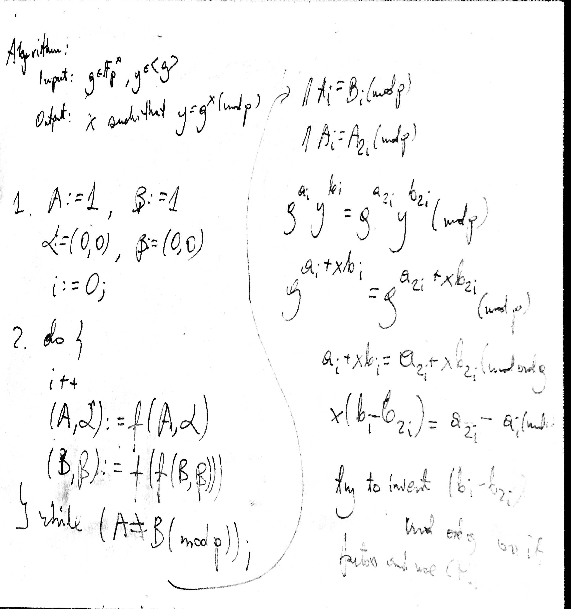

# Task 1

> 5 points
>
> deadline 6.03.2018

Implement Pollard's rho method for DLP in C/C++ using NTL.

## Input

1. `g \in {F_{p}}^{x}`
2. `y \in < g >`

## Output

1. `x` such that `y = g^{x (mod p)}`
2. `i`  - the amount of iterations made by the algorithm to print it out with the result.

## Algorithm

### Start

`A := 1`
`B := 1`
`alpha := (0, 0)`
`beta := (0, 0)`
`i := 0`